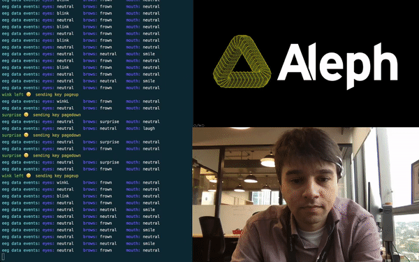

# Emotiv event-based keystroke

This is a small proof of concept how to trigger events from [Emotiv Insight](https://www.emotiv.com/insight/) to send keyboard events to any application, for example, triggering next or previous slide from a presentation using only the neural feedback.

Emotiv manufactures other EEG (electroencephalography) wireless devices among the Insight, which have 5 channels. Other models as the EPOC+ has 14 channles and EPOC Flex, a full range medical class EEG up to 32 channels.

The number of channels is directed related to resolution of brain waves resolution, enabling more accurated training and classification of patterns.

Regardless the model of Emotiv devices, we can perform some good use-cases using the available data, provided by Emotiv Apps ([EmotivBCI](https://www.emotiv.com/emotiv-bci/)) and SDK ([Cortex](https://emotiv.github.io/cortex-docs/#introduction)):

* Events (eye blinkig, mouth, browns)
* Facil expressions (neutral, smile, frown, clench, surprise)
* Mental commands (push, pull, lift, drop, left, right, rotate left, rotate right, rotate forwards, rotate backwards, rotate clockwise, rotate anticlockwise, disappear)
* Perfomance metrics (stress, engagement, interest, focus, excitement, relaxation)
* Gyroscope and accelerometer motion senors  (GyroX, GyroY, GyroZ, AccX, AccY, AccY, MagX, MagY and MagX)
* Raw data of theta, alpha, betaL, betaH and gamma waves, for a especific modeling

This app was modified (very small modificiations) from the original version available at [Emotiv Cortex Repository](https://github.com/Emotiv/cortex-example).

The goal is the send keystroke, keyboard events related to specific events get from Cortex API. 
For keyboard event sending, we choose the library [RobotJS](http://robotjs.io/).

Since the still not expense too much time training the events and facial expressions (Emotiv recommends a total of 8h sessions of training), our tests for this PoC was achieved looking to _surprise_ expressions and _right blinking_.

As said, on that test we use the neural feedback to change the next slide of a PowerPoint presentation. _Surprise_ expressions sends a event of _Page Down_ and right blinking sends a _Page Up_ event.

Next steps will focus on the other device, the EPOC+. With more channels shoud be less painfull training mental commands 😃.
